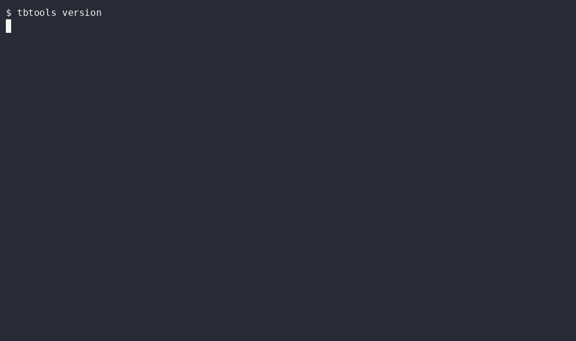
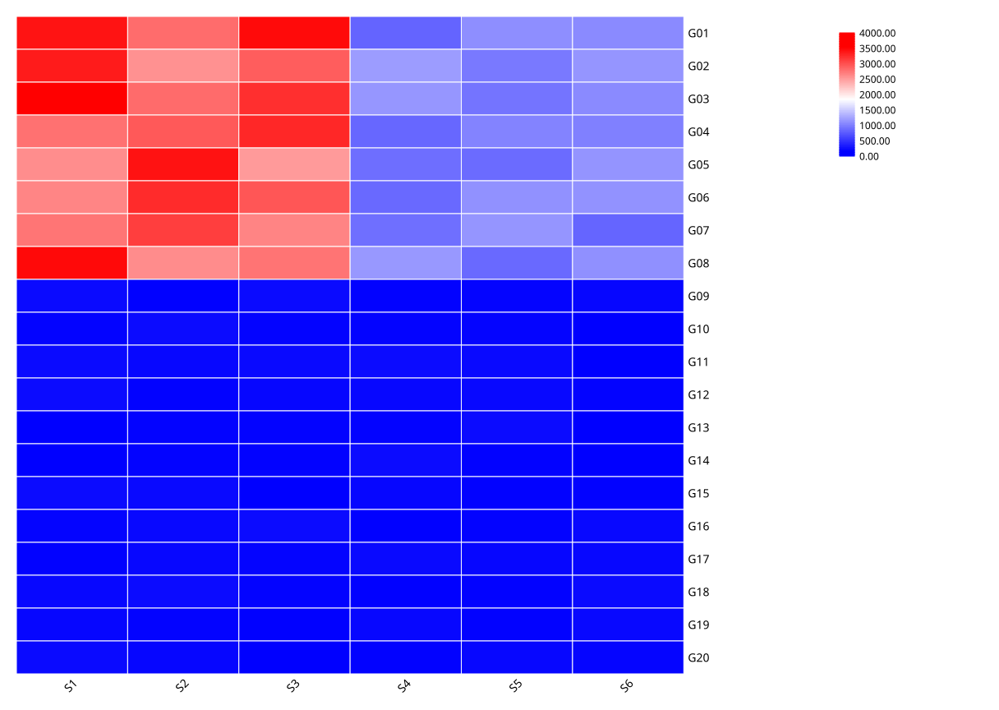
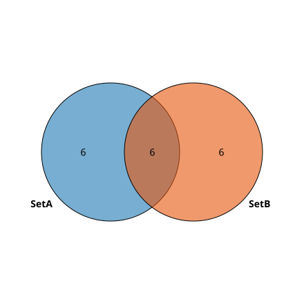
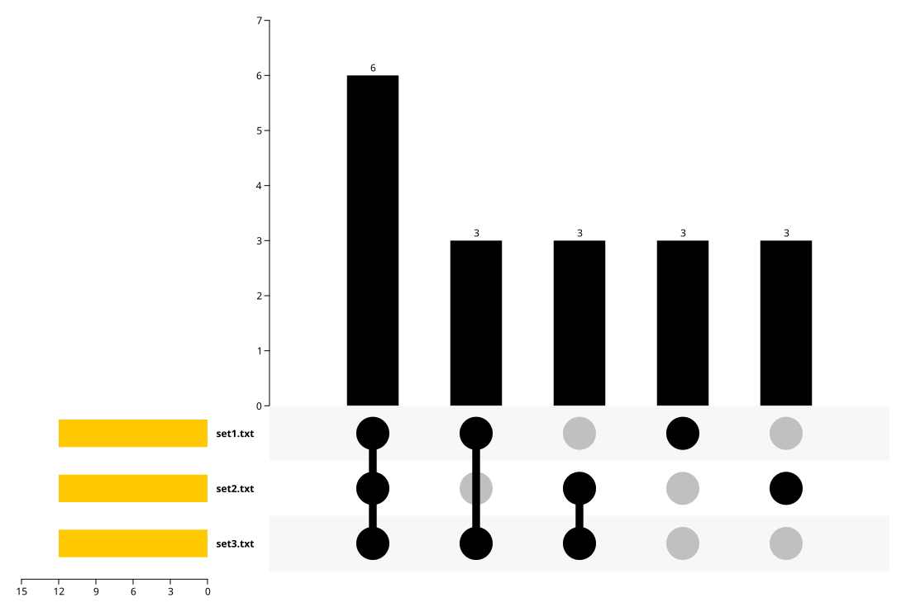
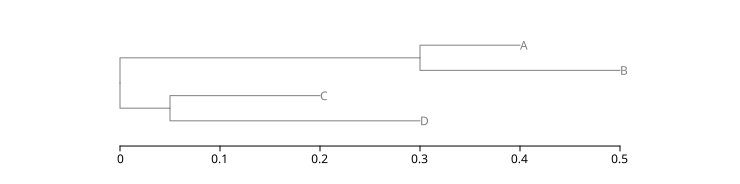
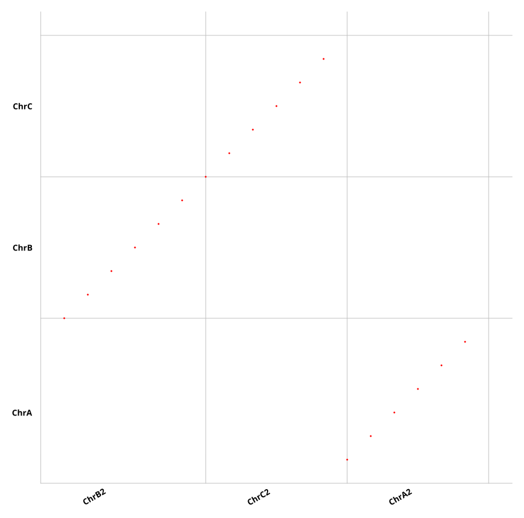
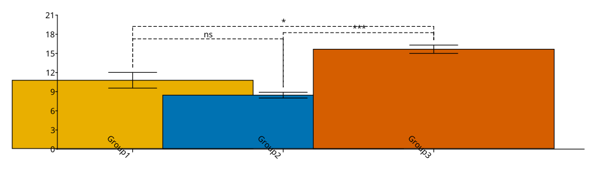

# TBtools CLI — TBtools-II 全功能命令行封装

[](https://github.com/qby1613527176-cmd/tbtools-cli/actions/workflows/test.yml)
[](LICENSE)
[](pyproject.toml)
[](docs/_generated/commands.md)
[](https://github.com/qby1613527176-cmd/tbtools-cli/releases)

> 把 [TBtools-II](https://github.com/CJ-Chen/TBtools)（2.535+）的全部功能封装成命令行，Linux/WSL 下免 GUI 直接使用。
> **218 个绘图/分析命令 + 188 个 RPC 数据工具 + 82 个命令行工具 + 118 个 Java 桥 + 任意引擎反射**，全部实测出图。
> 数字口径: 运行时统计以 `tbtools version` 为准;静态注册口径(276 命令/196 绘图)见 [docs/_generated/counts.md](docs/_generated/counts.md)（自动生成,防漂移）。
> 2026-08-31 达成 123 引擎里程碑（含 dualsyn 旧框架保存破解 + eFP 热图/全管线 miRNA/双向 BLAST 等），118 个 Java 桥，218 命令。10 批回归 162/162 PASS。

<div align="center">

**English** | 中文要点见各节说明（命令输出默认中文,`LC_ALL=en` 切换英文）


</div>

---

## 📺 Demo



10 秒演示: `tbtools version` → `doctor` → `search volcano` → `volcano 实跑出图`。
(`docs/images/demo.cast` 为 asciinema 原始录制,可 `asciinema play` 播放。)

```bash
# 本地播放
asciinema play docs/images/demo.cast
# 或上传 asciinema.org 网页播放(asciinema upload)
```

## 📑 Table of Contents

- [Demo](#demo)
- [Quick Start](#quick-start)
- [Features](#features)
- [Documentation](#documentation)
- [Installation](#installation)
- [Example Outputs](#example-outputs)
- [Plotting Engines (218)](#plotting-engines-218)
- [RPC Data Tools](#rpc-data-tools-188-methods)
- [CLI Tools](#cli-tools-82)
- [Any Engine Reflection](#any-engine-reflection-universal-fallback)
- [Project Structure](#project-structure)
- [兼容层退役计划](#兼容层退役计划)
- [Naming Convention](#naming-convention)
- [Known Limitations](#known-limitations)
- [FAQ](#faq)
- [Credits](#credits)
- [License](#license)

## 🚀 Quick Start

> **最小示例数据**（新人入门防格式坑）: 本仓库 `examples/data/` 为官方数据,`git clone` 或直接下载:
> `git clone --depth 1 https://github.com/qby1613527176-cmd/tbtools-cli` → `examples/data/` 即可复现本文所有命令。


```bash
tbtools version          # 查看版本（动态统计）
tbtools doctor           # 环境诊断（检查 Java/JAR/xvfb/依赖）
tbtools list              # 列出全部绘图/分析命令
tbtools list tools        # 列出全部命令行工具
tbtools help volcano      # 快捷帮助（自动定位分组）
tbtools rpc start         # 启动 RPC 服务器（188 方法；pid 文件+健康检查，死亡后 call/methods 自动拉起）
tbtools rpc status        # 查看 RPC 状态；rpc stop 停止
bash examples/scripts/run_examples.sh     # 一键验证（8 项核心功能）
```

### 配置文件

```bash
# ~/.config/tbtools-cli/config.toml
jar = "/path/to/TBtools_JRE1.6.jar"
[defaults]
threads = 4
format = "svg"
# preset = "nature"    # 取消注释启用默认预设
```

### Bash Completion（tab 补全）

```bash
source scripts/tbtools-completion.bash   # 临时启用
# 或永久安装:
cp scripts/tbtools-completion.bash ~/.local/share/bash-completion/completions/tbtools
```

### Man Page

```bash
man -l scripts/tbtools.1              # 查看 man page
# 或安装到系统:
sudo cp scripts/tbtools.1 /usr/local/share/man/man1/
```

### stdin/stdout 管道（CLI 工具层）

```bash
# stat-fasta 支持 stdin
 ./tbtools tool stat-fasta /dev/stdin /dev/stdout < seqs.fa
# ⚠️ 大部分 Java 引擎不认 /dev/stdin，管道支持有限
```

## ✨ Features

| 能力 | 状态 | 说明 |
|:---|:---:|:---|
| 绘图引擎 CLI | ✅ | 218 个（无头 SVG/PNG 输出,Linux 需 xvfb） |
| RPC 数据工具 | ✅ | 188 方法,自愈服务器（pid+健康检查+自动重启） |
| 管道（stdin/stdout） | ⚠️ | 仅部分 tool 层命令;绘图命令需真实文件路径 |
| Windows 绘图 | ⚠️ | 基本可用;无 xvfb 时部分绘图受限 |
| 联网命令（NCBI/API） | ⚠️ | srr2ena/pubmed/seqfetch 等需外网,被墙环境请配代理 |
| 中文路径 | ✅ | 已实测支持 |
| 并发/高吞吐 | ✅ | 1.2GB FASTA 23.9s 线性 |


| Layer | Capability | Entry |
|:------|:-----------|:------|
| 🎨 **绘图引擎** | 218 个（基因结构/Motif/热图/树/共线性/韦恩/ChIP-seq/柱图/环形图/标记设计/eFP 等） | `tbtools <plotName>` |
| 📊 **RPC 数据工具** | 188 个（FASTA/GFF/表达/Blast/富集/建树/引物等） | `tbtools rpc <method> '<json>'` |
| 🛠️ **命令行工具** | 82 个（extractFasta/statFasta/rpkmCal/tpmCalc/mimicVqsr 等） | `tbtools tool <name>` |
| 🔬 **任意引擎反射** | 万能兜底（任意 TBtools 引擎类） | `tbtools engine <class> key=value` |
| 🧩 **插件命令** | 12 个 CLI 化插件（GSEA/Notung reconcile/植物 TF motif 偏移/MEME 可视化/kallisto 定量/HMMer 全库扫描/MCScanX 加速/Newick 重命名/基因组 dot plot/diamond 蛋白注释/SMART 域注释/FIMO motif 扫描） | `tbtools table gsea` / `tbtools tree notung` 等 |

All engines are driven **headlessly** (via xvfb on Linux/WSL), no GUI needed. Verified with real biological data (oil-Camellia GRAS gene family etc).

## 📖 Documentation

> **每次调用前先查 `docs/COMMAND_REFERENCE.md`**（命令参考手册,自动生成命令清单见 `docs/_generated/commands.md`）——每个命令的输入格式、参数、示例、已知坑都在里面。

| 文档 | 内容 |
|:-----|:-----|
| [`docs/COMMAND_REFERENCE.md`](docs/COMMAND_REFERENCE.md) | **命令参考手册**：218 个命令（用法表+详细注释）+ 82 个 CLI 工具（18 类功能分组）+ 118 个桥 Javadoc（输入格式权威来源）+ 46 条实测坑位 + engine 反射 + RPC 指引 |
| [`docs/rpc_methods_reference.md`](docs/rpc_methods_reference.md) | RPC 188 方法参考（参数/返回值，89KB） |

```bash
# 快速查用法（不用翻手册）：
tbtools --help              # 绘图命令一屏预览
tbtools list tools          # CLI 工具列表
tbtools rpc methods         # RPC 方法列表
java -cp $TBTOOLS_JAR <引擎类>  # 无参运行 → 打印完整 [Usage] 参数表（含默认值）
```

---

## 📦 Installation

> **推荐路径**: `pip install tbtools-cli`（见 0;受限环境加 `--user` 或 venv）; **备用路径**: `git clone` + `install.sh`（见 1）。其余方式为历史兼容。

### 0. pip 安装（推荐，Python 包入口）

> ⚠️ **Windows 用户注意**: 绘图类命令在无 xvfb 时部分受限（工具类/RPC 全可用）;WSL2 推荐。详见 [FAQ](#faq)。
> 系统 Python 受 PEP 668 保护时（Debian/Ubuntu 23+），先建虚拟环境或加 `--user`：
> `python3 -m venv ~/.venv && source ~/.venv/bin/activate` 或 `pip install --user tbtools-cli`
```bash
pip install .            # 或 pipx install . / pip install git+https://github.com/qby1613527176-cmd/tbtools-cli
# 安装后 `tbtools` 直接可用（console_script）；JAR 仍需就位（见下）
```

### Requirements
- **Linux / WSL2 / macOS**（绘图需要 `xvfb-run`，可用 `sudo apt install xvfb`）
- **Windows**：支持工具类/RPC/表格类命令（Git Bash + TBtools-II/bin 加入 PATH）；绘图类命令受 xvfb 限制（部分可用）
- **JDK 11+**（`java`、`javac`）
- **TBtools_JRE1.6.jar**（TBtools-II 主 jar，~55MB）

### 1. Install（自动接入本机 TBtools）

```bash
git clone https://github.com/qby1613527176-cmd/tbtools-cli.git
cd tbtools-cli
```

**三种接入方式，AI/脚本可按需选用：**

```bash
# ① 自动搜索本机已有 TBtools jar 并配置（最常用）
tbtools setup --auto
#    → 自动扫描 ~/TBtools、~/Downloads、~/桌面、/mnt/*（WSL）、C:/TBtools（Git-Bash）、
#      /Applications（macOS）等常见位置，找到即写入 ~/.config/tbtools-cli/

# ② 知道 jar 路径，直接指定
tbtools setup /path/to/TBtools_JRE1.6.jar

# ③ 本机没有 jar？自动下载官方 portable 包并提取 jar（官方只发 zip，~300MB）
tbtools fetch-jar
#    → 自动查询最新含 portable 的 release，下载 → 提取 TBtools_JRE1.6.jar → 配置
#    可选: tbtools fetch-jar --version 2.475
```

手动方式（无 tbtools 时）：
```bash
./install.sh --jar /path/to/TBtools_JRE1.6.jar
# 或
export TBTOOLS_JAR=/path/to/TBtools_JRE1.6.jar
export PATH="$PWD/bin:$PATH"
```

### 2. Verify
```bash
tbtools doctor      # 一键检查 Java/jar/xvfb/可选依赖；jar 缺失时给出可执行指引
tbtools version     # 实时统计命令/桥/坑位数量
```

### 3. Auto-verify（一键回归，8 项核心功能示例图）

```bash
bash examples/scripts/run_examples.sh   # 运行 8 个代表性引擎 → examples/output/ 下生成示例图
```

---

## 🖼️ Example Outputs

| Heatmap | Venn / UpSet |
|:--|:--|
|  |  |
|  |  |

| Phylogenetic tree | Synteny (MCScanX + dot plot) | Grouped bar + significance |
|:--|:--|:--|
|  |  |  |

> 全部由本仓库 `examples/fulltest` 合成数据实测生成（`docs/images/`，SVG 可放大无损）。
> 复现: `bash examples/scripts/run_examples.sh`。

## 🎨 Plotting Engines (218)

### Gene structure / Motif / Sequence logo
```bash
# Gene structure (exons/UTR from GFF)
tbtools seq genestructure <input.gff> <mRNA_ids.txt> <out.svg> [genome.fa] [w] [h]
# Motif distribution (MEME XML)
tbtools seq motif <meme.xml> <idList.txt> <out.svg> [w] [h]
```
> 更多命令见 [docs/_generated/commands.md](docs/_generated/commands.md) 或 `tbtools list plots`
### Expression / Statistics
```bash
# Volcano plot (DEG: GeneID Log2FC pvalue)
tbtools volcano <deg.txt> <out.svg> [pvalCutoff] [fcCutoff] [w] [h]
# Expression level calculators (counts+len → RPKM/TPM; FPKM → TPM)
tbtools tool rpkmCal    --countsTable counts.tsv --lenInfo gene_len.tsv --outTable RPKM.out.tsv
```
> 更多命令见 [docs/_generated/commands.md](docs/_generated/commands.md) 或 `tbtools list plots`
### Phylogeny / Tree
```bash
# Tree + annotation tracks (TextAnno/HeatMap/BarPlot/Tile/StackBar/Domain...)
tbtools tree draw <treeMeta.cfg> <out.svg> [pad]
# Hclust → Newick
tbtools expr hclust <distance_matrix.tsv> <out.nwk>
```
> 更多命令见 [docs/_generated/commands.md](docs/_generated/commands.md) 或 `tbtools list plots`
### Genomic location / Circos / Synteny
```bash
# Gene chromosome location (GFF + IDs)
tbtools gxf genelocgff <gff3> <ids.txt> <out.svg> [--chrLen l.tsv --pairs p.tsv ...]
# Gene location (native CLI)
tbtools genelocation --ChrLen <chrlen.tsv> --FeaturePos <pos.tsv> --OutGraph <out.svg>
```
> 更多命令见 [docs/_generated/commands.md](docs/_generated/commands.md) 或 `tbtools list plots`
### Venn / Sets
```bash
# Venn 2/3/4 (native ArgsParser CLI)
tbtools sets venn2 --List1 a.txt --List2 b.txt --label1 A --label2 B --graph out.svg --prefix out
tbtools sets venn3 --List1 a.txt --List2 b.txt --List3 c.txt --label1 A --label2 B --label3 C --graph out.svg --prefix out
tbtools sets venn4 --List1 a.txt --List2 b.txt --List3 c.txt --List4 d.txt --label1 A --label2 B --label3 C --label4 D --graph out.svg --prefix out
```
> 更多命令见 [docs/_generated/commands.md](docs/_generated/commands.md) 或 `tbtools list plots`
### ChIP-seq / Others
```bash
# Peak-TSS heatmap
tbtools chipseq peaktss <gxf> <macs2_peak.xls> <out.svg> [--dist N]
# Peak chromosome distribution
tbtools chipseq peakdist <chrLen.tsv> <macs2_peak.xls> <out.svg> [--width W --height H]
```
> 更多命令见 [docs/_generated/commands.md](docs/_generated/commands.md) 或 `tbtools list plots`
## 📊 RPC Data Tools (188 methods)

```bash
tbtools rpc start                       # 启动 RPC 服务器 (port 8765)
tbtools rpc methods                     # list all 188 methods
tbtools rpc FastaStat.process '{"inputPath":"in.fa","outputPath":"out.xls"}'
tbtools rpc OneStepBuildATree.process '{"inputPath":"seqs.fa","outputPath":"outdir","options":{"ultraFastBS":true}}'
```

> 全部 188 方法见 [docs/rpc_methods_reference.md](docs/rpc_methods_reference.md) 或 `tbtools list rpc`

## 🛠️ CLI Tools (82)

```bash
tbtools tool <name> [args...]      # run any CLI tool; full help: tbtools list tools

# --- Fasta / Fastq ---
tbtools tool statFasta             # sequence statistics
tbtools tool extractFasta          # extract/filter FASTA by ID list
```

> 全部 82 个工具见 [docs/COMMAND_REFERENCE.md](docs/COMMAND_REFERENCE.md) 或 `tbtools list tools`

## 🔬 Any Engine Reflection (universal fallback)

```bash
tbtools engine <full.class.Name> key=value [--call method]
# example: QuickStatFasta
tbtools engine biocjava.bioIO.FastX.FastaIndex.QuickStatFasta inFile=seqs.fa --call stat
```

---

## 📁 Project Structure

```
tbtools-cli/
├── bin/
│   ├── tbtools            # unified entry (bash 兼容层，转发 python -m tbtools_cli.cli)
│   ├── tbplot.sh          # plotting engines（兼容层，逐步退役为转发）
│   ├── tbtools_rpc.sh     # RPC server & calls
│   └── tbcli.py           # 旧工具入口（已由 cli_tools_registry 替代，保留兼容）
├── tbtools_cli/           # ✅ Python 包（真正的入口）
│   ├── cli.py             # click 主 CLI（全命令注册 + rpc 自愈 + 纠错）
│   ├── auto_commands.py   # ENGINE_REGISTRY 表驱动命令工厂(命令数以 `tbtools version` 为准)
│   ├── cli_tools_registry.py  # 82 个 CLI 工具共享注册表
│   ├── command_metadata.json  # 276 命令元数据（gen_metadata 生成,唯一数据源）
│   ├── core.py            # run_java 包装 + 输入保护 + PITFALL_HINTS(46)
│   ├── presets.py / scenarios.py / config.py
├── pyproject.toml         # ✅ pip 安装（tbtools console_script）
├── bridges/               # 118 Java bridge sources
├── build/                 # compiled bridges (auto-generated)
├── config/config.sh       # unified config (TBTOOLS_JAR etc.)
├── scripts/               # tbtools-completion.bash + tbtools.1 + 工具脚本
├── examples/              # example data + scripts
├── scripts/               # rpc_regression_linux.sh 等工具脚本
├── tests/                 # pytest（83 passed：框架/命令/防漂移/输入保护）
├── docs/                  # detailed documentation
│   ├── COMMAND_REFERENCE.md  # 📖 命令参考手册（218 命令+82 工具+118 桥+46 坑位）
│   └── rpc_methods_reference.md  # RPC 188 方法参考
├── install.sh             # one-command installer
└── README.md
```

---

## 🛠️ 兼容层退役计划

`bin/tbplot.sh` / `bin/tbengine.sh` / `bin/tbcli.py` / `bin/tbtools_rpc.sh` 为旧入口兼容层（已打印 deprecation 警告）。
**计划 v2.0.0 移除**。新用法一律走 `tbtools`（Python 入口）;`.bashrc` 如引用了旧入口请迁移。

## 🏷️ Naming Convention

- **规范命令名是小写 camelCase**：`tableCast` / `tableMelt` / `recipBlast`（分组命令）
- 个别工具层保留旧大写注册名作别名：`TableCast` 与 `tableCast` 指向同一引擎（`tool TableCast` 兼容旧写法）
- 新旧入口并存是过渡设计，规范入口见 `tbtools list`

## ⚠️ Known Limitations

| Engine | Status |
|:-------|:-------|
| MicroGenomeViz | doesn't handle `join(complement(...))` |
| UnrootedTreeViz | hardcoded demo main |
| geneOnGenome CLI | jar compile-level bug |
| PhyloTreeView | needs TreeTab format (not pure Newick) |
| DualSyn | old JJplot2 framework; `plot()` works but save limited (window traversal fails) |
| FindBlockDual/Multiple | requires real genome data; synthetic small data triggers `ArrayList.get` OOB |
| peakAnno | small coordinates (<10kb) trigger `GxFOverlapIndexer` bin boundary bug; use real genome scale |
| MountainPlot/StackMotif | empty shell in TBtools jar (no implementation) |
| DistanceAdvanced | pure calculation, no plotting (use `distance` command instead) |

---

## ❓ FAQ

**Java 版本要求?** 需要 JRE 8+（推荐 11/17;引擎为 Java 8 编译,JDK 9+ 移除部分 javax.xml 类,`--verbose` 报 ClassNotFoundException 时见 `docs/_worklog` 修复记录）。`tbtools doctor` 会自动检测。

**Windows 支持?** 双击/终端可用（v2.475 实测）;绘图命令在 Windows 无 xvfb 时部分受限（见「Known Limitations」）。WSL2 经 /mnt/d 挂载 JAR 亦可。

**xvfb 是什么?** Linux 无头绘图必须的虚拟显示层。`sudo apt install xvfb`。`doctor` 会提示缺失。

**stdin/stdout 管道支持?** 仅 tool 层部分工具支持（/dev/stdin）;绘图命令需真实文件路径（Java 引擎不认 /dev/stdin）。

**为什么命令有大小写混用?** 小写 camelCase 为规范名,旧大写名作兼容别名（见 Naming Convention）。

**如何升级?** `git pull && pip install -e .`（源码安装）;JAR 用 `tbtools fetch-jar --yes` 更新。

## 🙏 Credits

- [TBtools](https://github.com/CJ-Chen/TBtools) — the underlying toolkit by Chengjie Chen
- This project is an independent CLI wrapper, not affiliated with TBtools

## 📄 License

This CLI wrapper is released under the **MIT License** (see [LICENSE](LICENSE)):
you may use, copy, modify, and distribute it freely, provided the copyright notice and
this permission notice are preserved in all copies or substantial portions.

The underlying [TBtools](https://github.com/CJ-Chen/TBtools) toolkit is also MIT-licensed
by its author Chengjie Chen. This project is an independent wrapper and is not affiliated with TBtools.

> 文档以英文版为准;命令帮助信息以 `tbtools <cmd> --help` 输出为准。
